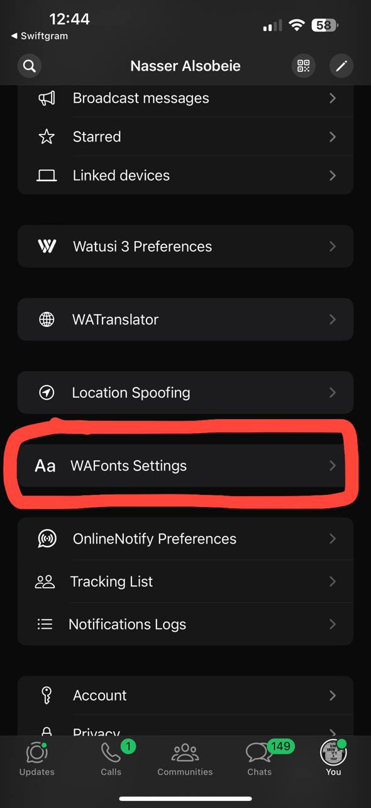
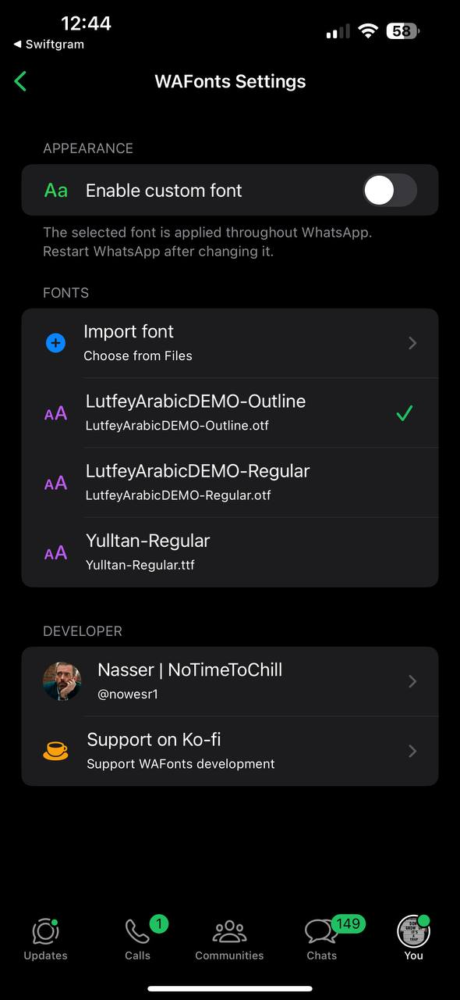
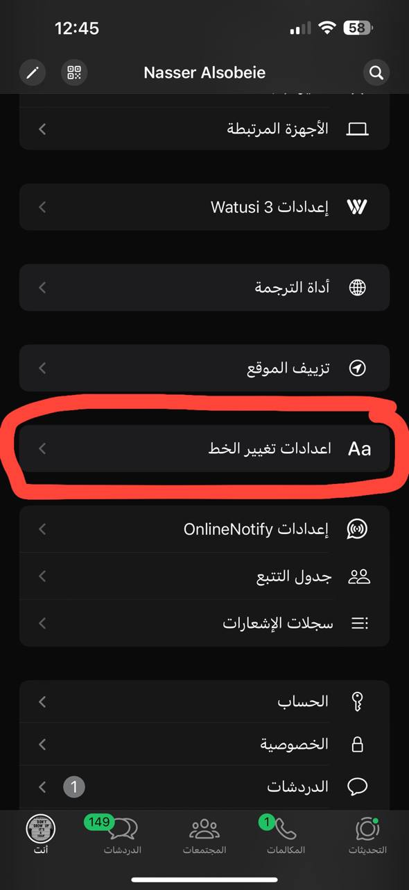
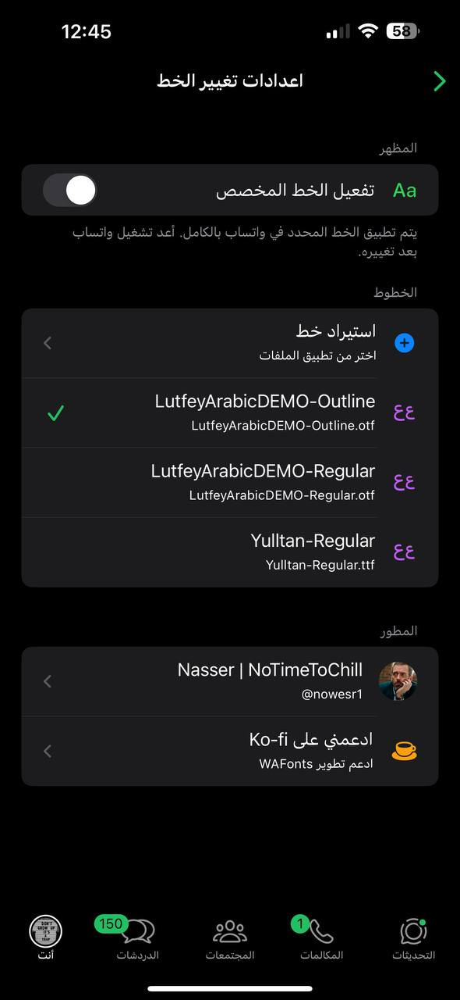

# WAFonts

WAFonts is a tweak that lets you import and apply custom fonts throughout WhatsApp. Its settings are integrated directly into WhatsApp.

 هي أداة لأجهزة iOS تتيح لك استيراد الخطوط المخصصة وتطبيقها داخل واتساب بالكامل. تظهر إعدادات الأداة مباشرة ضمن إعدادات واتساب.

## Features | المميزات

- Import custom `.otf`, `.ttf`, and `.ttc` font files from the Files app.
- Select, enable, or delete imported fonts from WhatsApp Settings.
- Apply the selected font throughout WhatsApp, including chats.
- Support for WhatsApp and WhatsApp Business.

---

- استيراد ملفات الخطوط المخصصة بصيغ `.otf` و`.ttf` و`.ttc` من تطبيق الملفات.
- اختيار الخطوط المستوردة وتفعيلها أو حذفها من إعدادات واتساب.
- تطبيق الخط المحدد في واتساب بالكامل، بما في ذلك المحادثات.
- دعم واتساب وواتساب للأعمال.

## Screenshots | لقطات الشاشة

### English

  
  

### العربية

  
  

## Usage | الاستخدام

Open **WhatsApp → Settings → WAFonts Settings**, import a font from Files, select it, and enable the custom-font switch. Restart WhatsApp after changing the selected font.

افتح **واتساب ← الإعدادات ← اعدادات تغيير الخط**، ثم استورد خطاً من تطبيق الملفات وحدده وفعّل خيار الخط المخصص. أعد تشغيل واتساب بعد تغيير الخط المحدد.

## Developer | المطور

**Nasser | NoTimeToChill**

- X: [@nowesr1](https://x.com/nowesr1)
- Ko-fi: [Support WAFonts development](https://ko-fi.com/nowesr)

## Disclaimer | إخلاء المسؤولية

WAFonts is an independent project and is not affiliated with or endorsed by WhatsApp or Meta. Use it at your own risk.

WAFonts مشروع مستقل وغير تابع أو معتمد من واتساب أو شركة Meta. استخدام الأداة على مسؤوليتك الخاصة.
